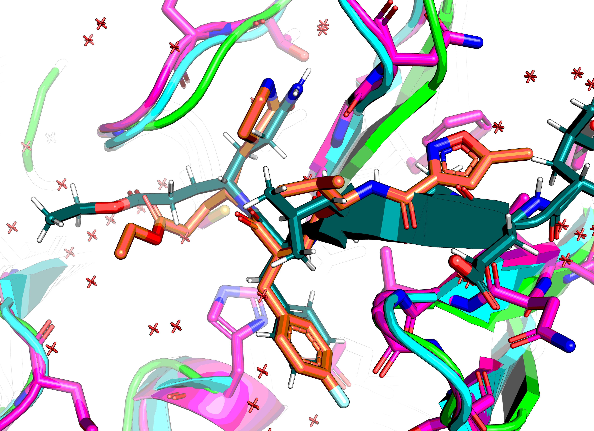

# EV-D68-3C-protease
Follow-up suggestions for EV-D68 3C protease fragment-based drug-discovery campaign of ASAP consortium.

Pipeline name `Enterovirus D68 3C protease`: https://asapdiscovery.org/pipeline/
Family: Picornaviridae
Targeting details: https://www.notion.so/asapdiscovery/Targeting-Opportunity-Enterovirus-3C-protease-A71-89ebfbb23d4d47f6848ecabc432fed17
XChem data: https://fragalysis.diamond.ac.uk/viewer/react/preview/target/D68EV3CPROA

## Notes on target
Protein is a monomer in native state but there is a crystallographic dimer in the structure.
The N-terminal Met of Chain A sits in the active site of Chain B (PDB:8CNX)

### Native substrate
Cannot find a conservation logo, but it's EALFQ↓GPPQF (2C↓3A) and TAKVQ↓GPGFD (3B↓3C)

https://www.rcsb.org/structure/2B0F
2B0F chain B X[ACE]LEALFX[YTF] where YTF is Gln-like+ethylpropionate, where the former has no C-terminal peptide bond,
but a covalent bond to the catalytic Cys. The latter is a glycine.

[rupintrivir](https://en.wikipedia.org/wiki/Rupintrivir) bound to CVA16 3C https://www.ebi.ac.uk/pdbe/entry/pdb/3sji
residue name: AG7

## Reference structure

No reference file provided in Fragalysis... :shrug:
Aligning to first.

## To do

* Optional: Extract peptidomimetics and nativise them
