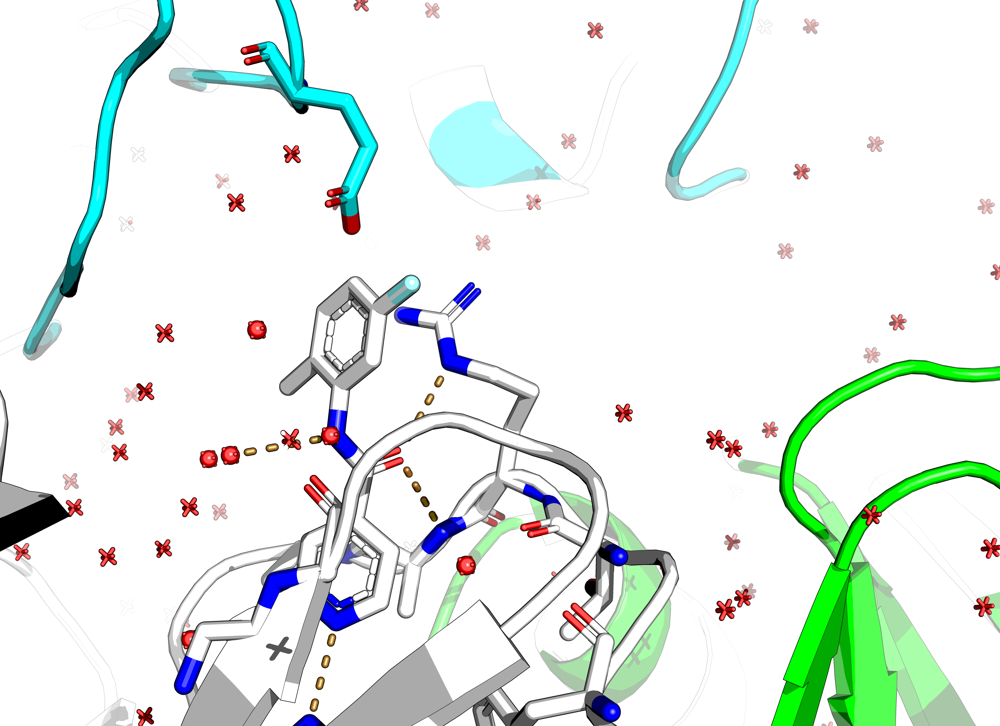

# EV-D68-3C-protease
Follow-up suggestions for EV-D68 3C protease fragment-based drug-discovery campaign of ASAP consortium.

Pipeline name `Enterovirus D68 3C protease`: https://asapdiscovery.org/pipeline/
Family: Picornaviridae
Targeting details: https://www.notion.so/asapdiscovery/Targeting-Opportunity-Enterovirus-3C-protease-A71-89ebfbb23d4d47f6848ecabc432fed17
XChem data: https://fragalysis.diamond.ac.uk/viewer/react/preview/target/D68EV3CPROA

## Notes on target
Protein is a monomer in native state but there is a crystallographic dimer in the structure.
The N-terminal Met of Chain A sits in the active site of Chain B (PDB:8CNX)

### Native substrate
Cannot find a conservation logo, but it's EALFQ↓GPPQF (2C↓3A) and TAKVQ↓GPGFD (3B↓3C)

From paper: https://www.ncbi.nlm.nih.gov/pmc/articles/PMC3624371/

https://www.rcsb.org/structure/2B0F
2B0F chain B X[ACE]LEALFX[YTF] where YTF is Gln-like+ethylpropionate, where the former has no C-terminal peptide bond,
but a covalent bond to the catalytic Cys. The latter is a glycine.

[rupintrivir](https://en.wikipedia.org/wiki/Rupintrivir) bound to CVA16 3C https://www.ebi.ac.uk/pdbe/entry/pdb/3sji
residue name: AG7
The glutamine terminal amide is replaced by a 2-pyrrolidone.
The phenylalanine benzene has a para-fluoro group.
The rest is backbone interactions basically.

## Reference structure

No reference file provided in Fragalysis... :shrug:
Aligning to first.

## Fragment Preparation

* [Extraction notebook](02_hit-prep/frag-extraction.ipynb)
* [hit theft](02_hit-prep/hit-theft.ipynb)
* [Filter and fragment](02_hit-prep/filter_n_frag.ipynb)

As I know where the native structure is, I can filter out the crap.

This leaves with these 19 out of 104.
Stealing ligands from the PDB gives another 25 — see [filtered](images/filtered_hits.png).

Fragmenting these gives 992. Ouch.

## Noteworthy

Of the hits near the catalytic triad, those close to H161 are interesting.
This is because the native substrate has a conserved glutamine at this position (P-1).

Of these, x1604 has a bromophenol that interacts with both protonated cys and H

## Merging

* [Fragmenstein merging](03_merge-fragmenstein/fragpipe.ipynb)

Mergers: https://michelanglo.sgc.ox.ac.uk/data/5066835a-a2df-4723-ad92-5adfa622cd74

This is rather unappealing. None of the hits gets a great ∆∆G and there's a limited number of interactions.

Looking at [interaction table](03_merge-fragmenstein/interactions.csv) and filtering by key atoms

PV-005271719018 and Z2747642578 form a new halogen bond with Cys147,
but both are under -3 kcal/mol and present the pointless crystal contact decoration
that is driven by R143.

For example, x0980 sticks out.

PV-003615179414 is an example of a high scoring x0980 derivative, that does not inspire.

Z4043126410 forms a hydrogen bond (donor) with the thiol of Cys147, but it's also under -3 kcal/mol.

PV-004190278975 forms an interaction with a hydroxyl group to Gly166 akin to a crystal water.
At -4.1 kcal/mol (LE of 0.3 neg kcal/mol/HA) it is strong, but is super small.
It is based off x1498.

However, these are all dense mergers.
None link different pockets.

Based on this the fragment network mergers were done with a different tactic.

The hits of prior structures from above are solely peptidomic in nature. So would increase combinatorial complexity
for no reason.

As a result, the hits were inspected manually and the x0771 and x1604 which form interactions with Cys147 and H161
were trimmed on unnecessary fused rings as these do not decompose (see [x1604 note](x1604.md)).

These were used along with the rest of the substrate pocket in the fragment network merger,
with a filter against pointless synthons from crystal contacts.

Unfortunately, the only possible followups were those using benzenes and another hit.
Without benzenes, no followups from vendors were possible.

https://michelanglo.sgc.ox.ac.uk/data/e934e6d1-61e4-4fe8-b57f-166bd5e37c31

## To do

* [x] Make reference
* [] Optional: determine RMSD of polymers in each structure
* [x] Extract fragments
* [] Assign library — metadata has SMILES! :tada:
* [] Optional: Fragment native substrate
* [x] Select bio relevant fragments
* [] ~Fragmenstein score — not great, but not terrible, ideally proper FEP~ — circumvented by bio relevance
* [x] Fragmenstein merger, analogue search, place and PLIP annotate interactions
* [x] Fragment network elaborations
* [] ~Fragmenstein synthon merger, analogue search, place and PLIP annotate interactions~
* [] CoPriNet price
* [] Forcefully organise fragment picking meeting
