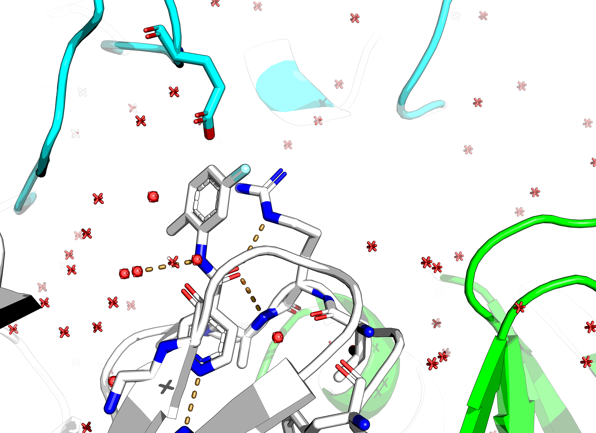

[Fragmenstein merging](03_merge-fragmenstein/fragpipe.ipynb)

Mergers: https://michelanglo.sgc.ox.ac.uk/data/5066835a-a2df-4723-ad92-5adfa622cd74

This is rather unappealing. None of the hits gets a great ∆∆G and there's a limited number of interactions.

Looking at [interaction table](03_merge-fragmenstein/interactions.csv) and filtering by key atoms

PV-005271719018 and Z2747642578 form a new halogen bond with Cys147,
but both are under -3 kcal/mol and present the pointless crystal contact decoration
that is driven by R143.

For example, x0980 sticks out.

PV-003615179414 is an example of a high scoring x0980 derivative, that does not inspire.

Z4043126410 forms a hydrogen bond (donor) with the thiol of Cys147, but it's also under -3 kcal/mol.

PV-004190278975 forms an interaction with a hydroxyl group to Gly166 akin to a crystal water.
At -4.1 kcal/mol (LE of 0.3 neg kcal/mol/HA) it is strong, but is super small.
It is based off x1498.

However, these are all dense mergers.
None link different pockets.

Based on this the fragment network mergers were done with a different tactic.

The hits of prior structures from above are solely peptidomic in nature. So would increase combinatorial complexity
for no reason.

As a result, the hits were inspected manually and the x0771 and x1604 which form interactions with Cys147 and H161
were trimmed on unnecessary fused rings as these do not decompose (see [x1604 note](x1604.md)).

These were used along with the rest of the substrate pocket in the fragment network merger,
with a filter against pointless synthons from crystal contacts.

Unfortunately, the only possible followups were those using benzenes and another hit.
Without benzenes, no followups from vendors were possible.

https://michelanglo.sgc.ox.ac.uk/data/e934e6d1-61e4-4fe8-b57f-166bd5e37c31