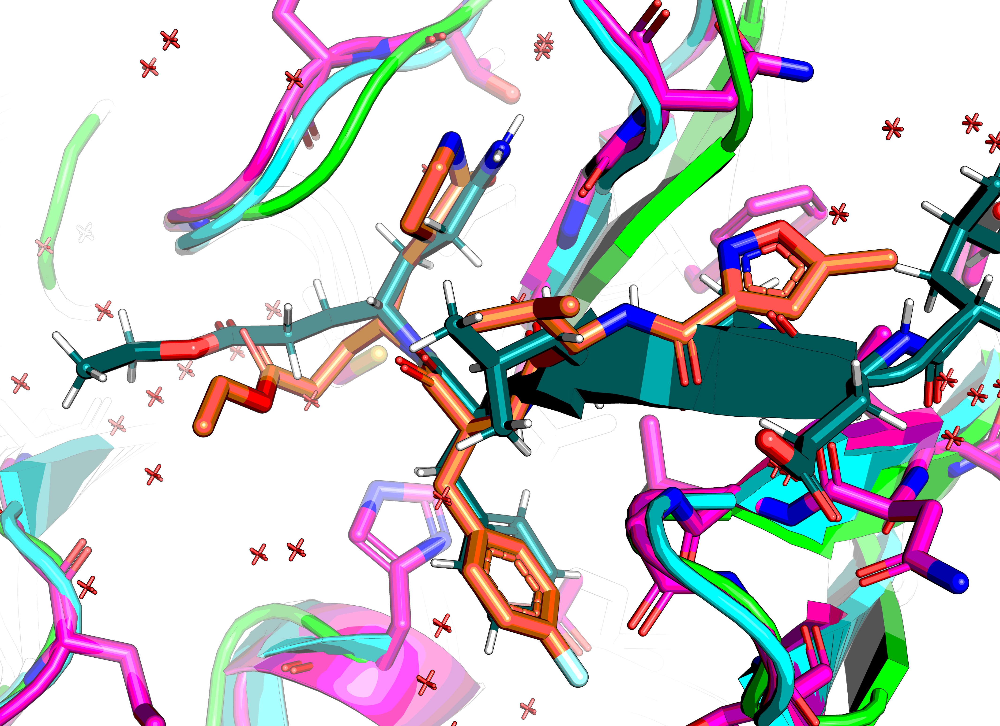
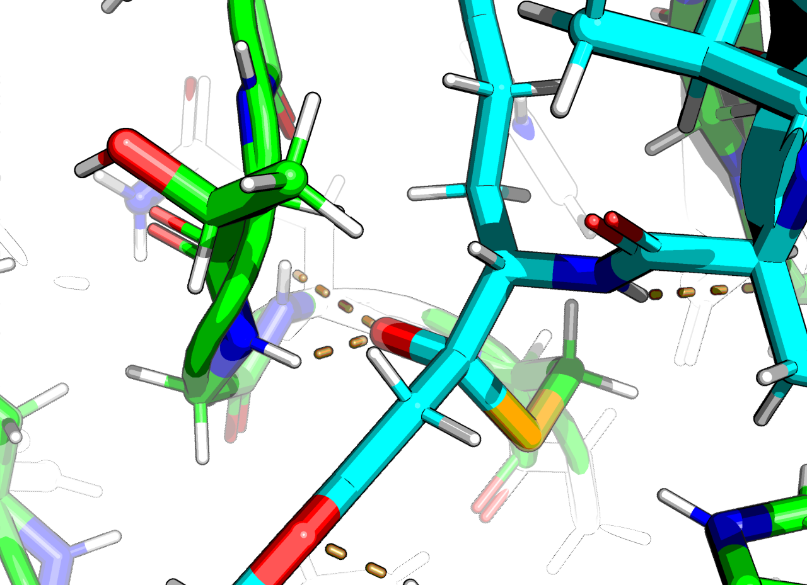
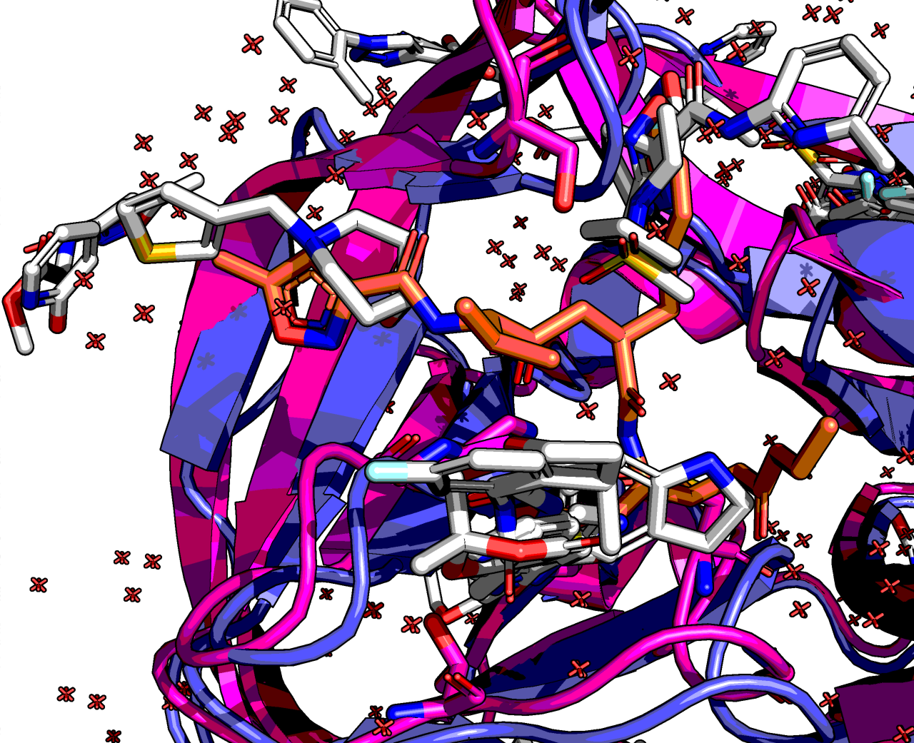
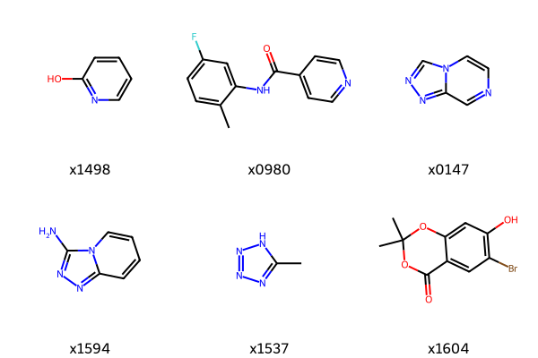
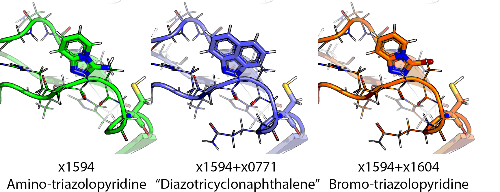

# EV-D68-3C-protease
Follow-up suggestions for EV-D68 3C protease fragment-based drug-discovery campaign of ASAP consortium.

Pipeline name `Enterovirus D68 3C protease`: https://asapdiscovery.org/pipeline/
Family: Picornaviridae
Targeting details: https://www.notion.so/asapdiscovery/Targeting-Opportunity-Enterovirus-3C-protease-A71-89ebfbb23d4d47f6848ecabc432fed17
XChem data: https://fragalysis.diamond.ac.uk/viewer/react/preview/target/D68EV3CPROA

Presentation: [ASAP-CompChem-elaborations-MF.pptx[ASAP-CompChem-elaborations-MF.pptx]

> :warning: This repo is basically abandoned and newer data was never uploaded

## Notes on target
Protein is a monomer in native state but there is a crystallographic dimer in the structure.
The N-terminal Met of Chain A sits in the active site of Chain B (PDB:8CNX)

### Native substrate
Cannot find a conservation logo, but it's EALFQ↓GPPQF (2C↓3A) and TAKVQ↓GPGFD (3B↓3C)

From paper: https://www.ncbi.nlm.nih.gov/pmc/articles/PMC3624371/

https://www.rcsb.org/structure/2B0F
2B0F chain B X[ACE]LEALFX[YTF] where YTF is Gln-like+ethylpropionate, where the former has no C-terminal peptide bond,
but a covalent bond to the catalytic Cys. The latter is a glycine.

[rupintrivir](https://en.wikipedia.org/wiki/Rupintrivir) bound to CVA16 3C https://www.ebi.ac.uk/pdbe/entry/pdb/3sji
residue name: AG7
The glutamine terminal amide is replaced by a 2-pyrrolidone.
The phenylalanine benzene has a para-fluoro group.
The rest is backbone interactions basically:

### Oxyanion transistion state

The covalents let me make an oxyanion model:

## Triad

* Catalytic cysteine: C146
* Base: H40
* Acid E71
* Oxyanion hole: backbone amide nitrogens of G145 and Q146
* P-1 residue glutamine (conserved) terminal hole: H160 (HIE, locked by Y137) and amide oxygen of T141

## Reference structure

No reference file provided in Fragalysis... :shrug:
Aligning to first.

## Fragment Preparation

* [Extraction notebook](02_hit-prep/frag-extraction.ipynb)
* [hit theft](02_hit-prep/hit-theft.ipynb)
* [Filter and fragment](02_hit-prep/filter_n_frag.ipynb)

As I know where the native structure is, I can filter out the crap.

This leaves with these 19 out of 104.
Stealing ligands from the PDB gives another 25 — see [filtered](images/filtered_hits.png).

Fragmenting these gives 992. Ouch.

## Noteworthy

> TL;DR: x1594, x1604, x0771 interact with bromide and amide pocket.
> x0147, x1537 bind the amide pocket like x1594, via a triazole.
> The amide pocket is also occupied by x1498, x0980. 
> x1083, x1305 and x1247 weakly fill the P-2 pocket.
> HOH164 is a tightly bound water that fills the oxyanion hole —no hit displaces it.
> In the amide pocket there's a very trapped water, HOH83, that no hit displaces.

Of the hits near the catalytic triad, those close to H161 are interesting.
This is because the native substrate has a conserved glutamine at this position (P-1).

Of these, x1604 has a bromophenol that interacts with both protonated cys and H.

This hit was looked into further in [x1604 notes](x1604.md).

Another subset of hits had either an amide like the native substrate or a deprotonated diazo-ring.
One such hit is x1594. Here are three purchasable version of the group that interacts with the catalytic cysteine.

For more see [x1594 notes](x1594.md). However, a major drawback is it is not an overly elaboratable set.

In terms of the P-2 site, the hits are on the 2 hydrogen bond mark including water network.

## Results

Initial results are in [initial_results notes](initial_results.md)

## To do

* [x] Make reference
* [] Optional: determine RMSD of polymers in each structure
* [x] Extract fragments
* [] Assign library — metadata has SMILES! :tada:
* [] Optional: Fragment native substrate
* [x] Select bio relevant fragments
* [] ~Fragmenstein score — not great, but not terrible, ideally proper FEP~ — circumvented by bio relevance
* [x] Fragmenstein merger, analogue search, place and PLIP annotate interactions
* [x] Fragment network elaborations
* [] ~Fragmenstein synthon merger, analogue search, place and PLIP annotate interactions~
* [] CoPriNet price
* [] Forcefully organise fragment picking meeting
