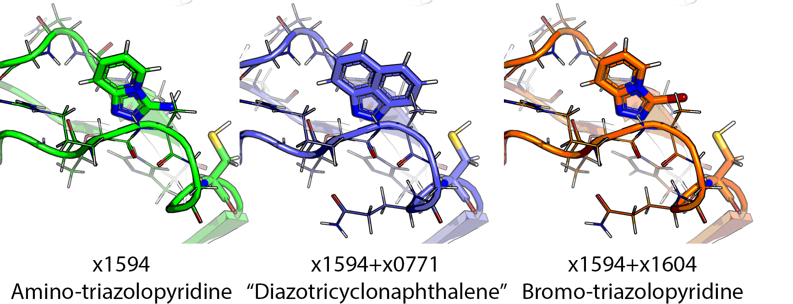

## x1594

In three hits, in glutamine pocket, instead of an acceptor oxygen from the amide,
there is a diazo group.  The diazo group is forming two hydrogen bonds, one with His161 in HIE form
—the HID form is key for deprotonation of Cys147. So these diazo hits would lock away the reactive deprotonated cysteine form.
In terms of interactions with the cysteine there are three hits:

* x1594 amino nitrogen: hydrogen bond donor to cysteine
* x1604 bromine: halogen bonds with cysteine
* x0771 benzene part of the indoline: pi–sulfur bonds with cysteine

Combining these gives these potential mergers that are acceptable by Fragmenstein metrics:
(The ∆∆G is rubbish as soft obital interactions aren't a thing classical molecular mechanics can do)

| Zinc ID | Enamine | SMILES |
| ------- | ------- | ------ |
| ZINC39193569 | EN300-131088 | Brc1nnc2ccccn12 |
| ZINC34320189 | BBV-79236296 | c1cc2c3c(cccc3c1)N=N2 |

However, neither of these can bridge the 7 Å gap to the Phe cluster.

## Water

There is a trapped water nearby that is not interacting with the ligands.
ZINC91252472 could be a solution to interact with it.
It causes some movement but the predicted potential improves, so may be interesting.

## Expansions

| name             | smiles                       | error   | mode      |       ∆∆G |   ∆G_bound |   ∆G_unbound |   comRMSD |   N_constrained_atoms |   N_unconstrained_atoms |    runtime | regarded       | disregarded   |
|:-----------------|:-----------------------------|:--------|:----------|----------:|-----------:|-------------:|----------:|----------------------:|------------------------:|-----------:|:---------------|:--------------|
| ZINC299888951    | Nc1noc2c(O)cccc12            |         | expansion | -4.97589  |  -4.81835  |   0.157546   |  0.229329 |                    10 |                       1 | 1246.79    | ['x1594L0AP1'] | []            |
| ZINC20221762     | NCc1noc2ccc(Cl)cc12          |         | expansion | -4.75892  |  -4.69133  |   0.0675892  |  0.150931 |                    10 |                       2 | 4432.69    | ['x1594L0AP1'] | []            |
| ZINC67175723     | Nc1noc2ccc(Cl)cc12           |         | expansion | -4.75762  |  -4.64493  |   0.112684   |  0.109855 |                    10 |                       1 |  618.526   | ['x1594L0AP1'] | []            |
| ZINC3818469      | Nc1nsc2ccc(Cl)cc12           |         | expansion | -3.48313  |  -3.38062  |   0.102512   |  0.41308  |                    10 |                       1 |  613.271   | ['x1594L0AP1'] | []            |
| ZINC34320189     | c1cc2c3c(cccc3c1)N=N2        |         | expansion | -2.86227  |  -2.85248  |   0.00979005 |  0.33507  |                    10 |                       2 |   18.4149  | ['x1594L0AP1'] | []            |
| ZINC74377172     | NCc1nnc2cc(Cl)ccn12          |         | expansion | -2.71476  |  -2.56902  |   0.145741   |  0.248453 |                    10 |                       2 | 4421.97    | ['x1594L0AP1'] | []            |
| ZINC000725593613 | Cl[C@@H]1C=CC2=NN=C(Br)C2=C1 |         | expansion | -2.50973  |  -2.39739  |   0.112346   |  0.48249  |                    10 |                       1 |  372.159   | ['x1594L0AP1'] | []            |
| ZINC000725593612 | Cl[C@H]1C=CC2=NN=C(Br)C2=C1  |         | expansion | -2.20052  |  -2.08818  |   0.112342   |  0.491868 |                    10 |                       1 |  367.596   | ['x1594L0AP1'] | []            |
| ZINC36240520     | NCc1nnc2ccc(Cl)cn12          |         | expansion | -2.17266  |  -2.05416  |   0.118494   |  0.367815 |                    10 |                       2 | 4427.16    | ['x1594L0AP1'] | []            |
| ZINC238659177    | N[C@@H]1N=Nc2ccc(Cl)cc21     |         | expansion | -1.88035  |  -1.78831  |   0.0920402  |  0.235399 |                    10 |                       1 |  468.255   | ['x1594L0AP1'] | []            |
| ZINC238664892    | N[C@H]1N=Nc2ccc(Cl)cc21      |         | expansion | -1.65096  |  -1.55892  |   0.0920404  |  0.380164 |                    10 |                       1 |  462.333   | ['x1594L0AP1'] | []            |
| ZINC8616242      | Nc1nnc2ccccn12               |         | expansion | -1.57304  |  -1.42217  |   0.150875   |  0.248308 |                    10 |                       0 |    4.30663 | ['x1594L0AP1'] | []            |
| ZINC107320578    | Nc1nnc2ccc(Cl)cn12           |         | expansion | -1.2382   |  -1.09173  |   0.146468   |  2.34704  |                    10 |                       2 | 3074.56    | ['x1594L0AP1'] | []            |
| ZINC39193569     | Brc1nnc2ccccn12              |         | expansion | -0.942248 |  -0.836071 |   0.106177   |  0.483865 |                    10 |                       0 |   12.9127  | ['x1594L0AP1'] | []            |
| ZINC91252472     | NCc1nnc2cc(Cl)ccn12          |         | expansion | -0.901296 |  -0.755555 |   0.145741   |  1.10069  |                    10 |                       2 | 3682.11    | ['x1594L0AP1'] | []            |
| ZINC307527887    | NCc1nnc2cc(Cl)ccn12          |         | expansion | -0.442131 |  -0.317007 |   0.125125   |  1.44076  |                    10 |                       2 | 3655.78    | ['x1594L0AP1'] | []            |
| ZINC86492581     | Nc1noc2c(Cl)cccc12           |         | expansion | -0.248523 |  -0.101145 |   0.147378   |  0.493602 |                    10 |                       1 | 1252.25    | ['x1594L0AP1'] | []            |

