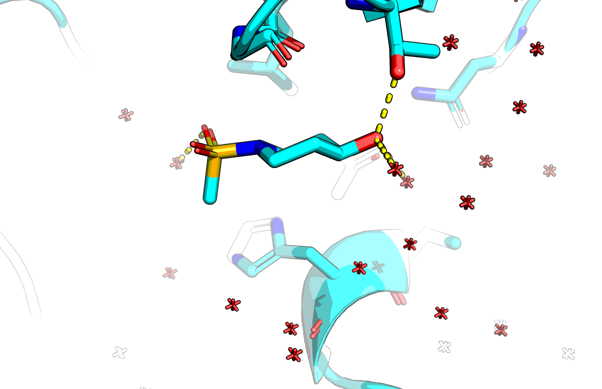
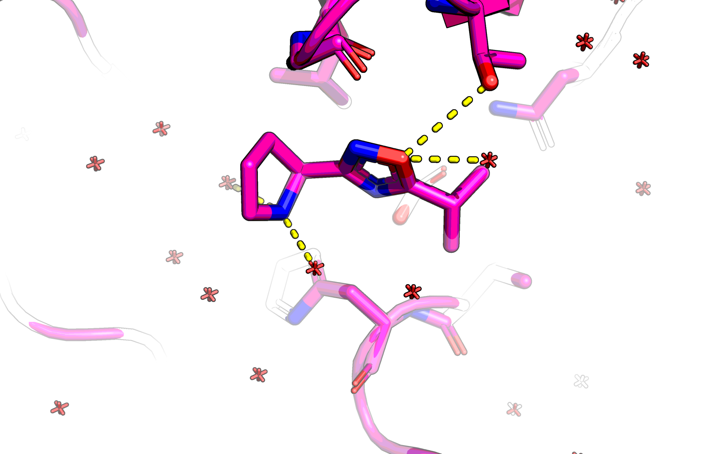
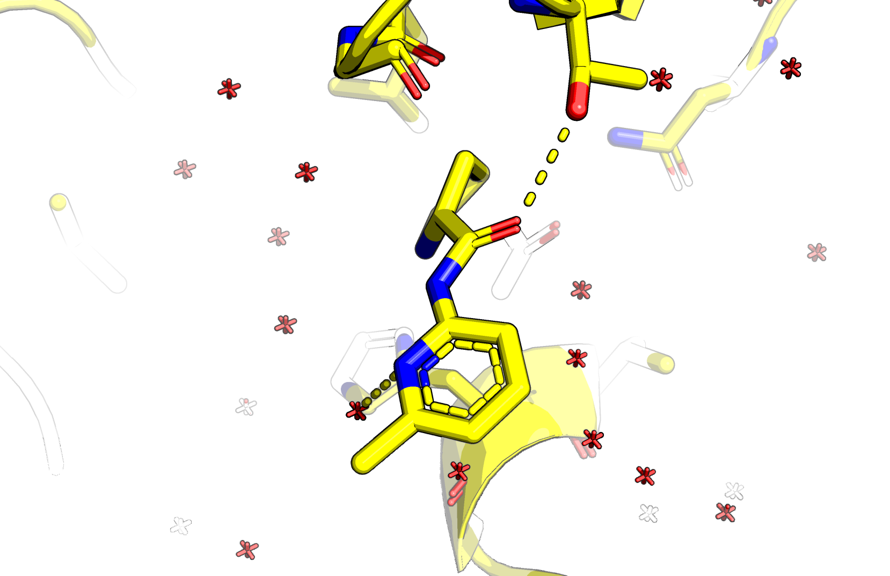

## P-2 site

The consensus for the P-2 site is that it is an anything pocket,
where catalytically it's something like F>V>I>E>T based off Tan et al 2013.

The hits x1083, x1305 and x1247 are not great, but not artefacts either.

The curious thing is that the Phe forms a pi-pi interaction in prior peptidomimetic rupintrivir (AG7) with His40,
yet no XChem hit bound with a pi-pi —x1083 S is > 5Å and x1305 oxadiazole ring is 4 Å.
There is a peptidic amide oxygen nearby and the triad acid E77, but no hit interacts with them.

The T132 is popular, but simply loading PDB:2B0F in PyMOL and doing the mutagenesis wizard shows that
this is out of reach to either threonine or glutamine (as is K61 as expected).

I have not checked its conservation.