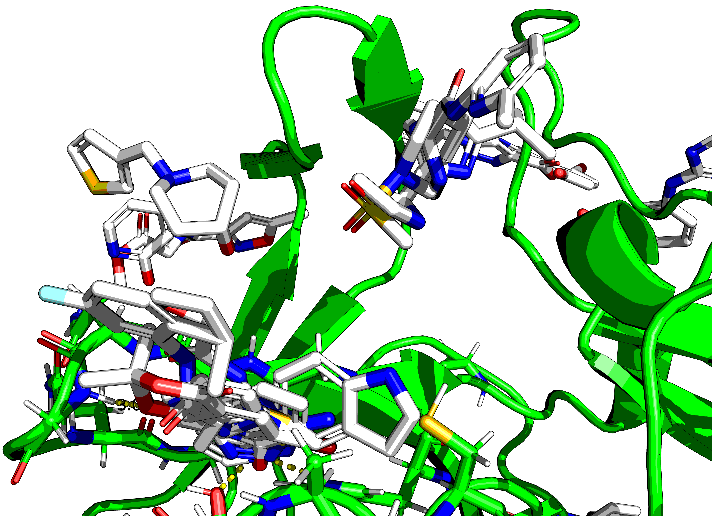
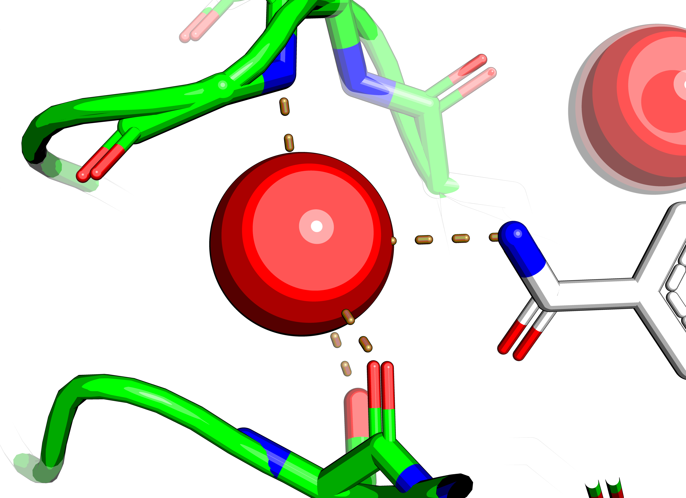
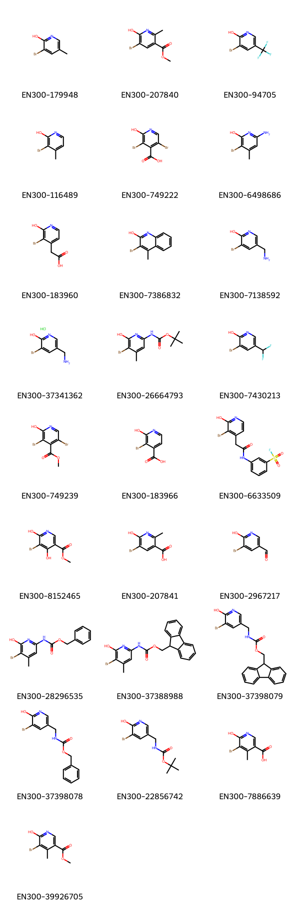

## Observations

A peptidomimetic exists that binds to the active site of the protein similarly to the native substrate.

Some hits bind nearby, but not in the same way.

Two hits stand out.
Of note are x0771:

The aromatic benzene ring is probably forming a &pi;-S bond, but the pyrrolidine is not interacting with the thiol.
It is most likely a waste of space.

and x1604:

This has a bromophenol that interacts with both the catalytic cysteine and the histidine.
The bromide is interacting with the thiol.
This is interesting.

Running ROCS on Enamine BB w/ this scaffold, gives an azide:

Click-chemistry is not doable via the CAR system ATM, but a triazole ring would be very nice there.
T3P amidation to link the hits in the P-1 and P1 pockets is a terrible idea as this is a cysteine protease.

This side investigation stems from the problem that fused ring systems are not decomposed by BRICS,
so the lactone ring in x1604 is never separated from the benzene,
and the pyrrolidine in x0771 is never separated from its benzene.

Parenthetically, the nitrogen of the amide of x0771 is interacting with a trapped water,
a pyridine for x1604 could be a nice option. Pyridine is deprotonated so that needs to be checked.
The water that it interacts with is already forming donor bonds to the protein.

Nethertheless, a pyridine would make more sense or a methylketone-ring would have bound.

In terms of options, there are a few 3-bromo-4-methylpyridin-2-ol (= para-methyl, `Cc1ccnc(O)c1Br`) 
and 3-bromo-5-methylpyridin-2-ol ( = meta-methyl, `Cc1cnc(O)c(Br)c1`) expansions in the Enamine BB dataset,
so there will be many expansions in REAL.

An amine at that position, `c1cccc(Br)c1O` may be possible.
But would be limited to Suzuki couplings as amidation would not be possible.
Only EN300-99376 is available in the Enamine BB dataset that fits this description.

### Plan

Place with Fragmenstein several of these compounds and see if any are good.
Use as basis for Steph's code.

