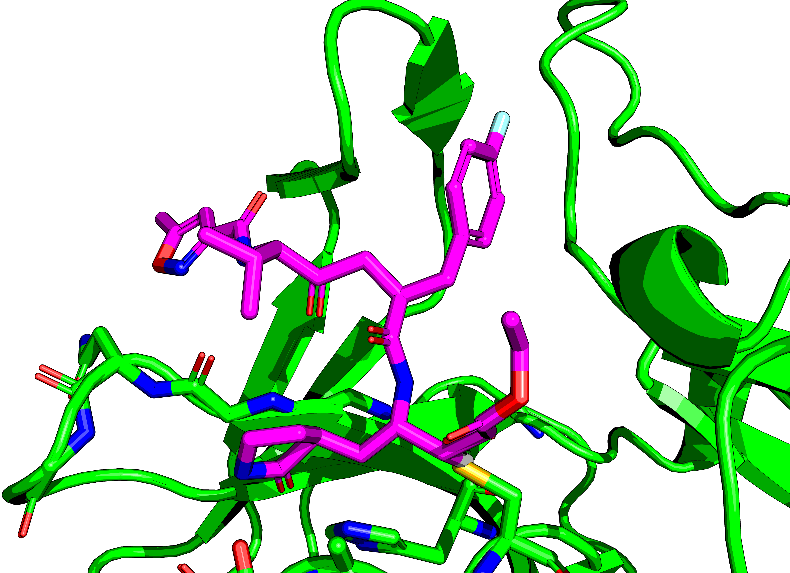
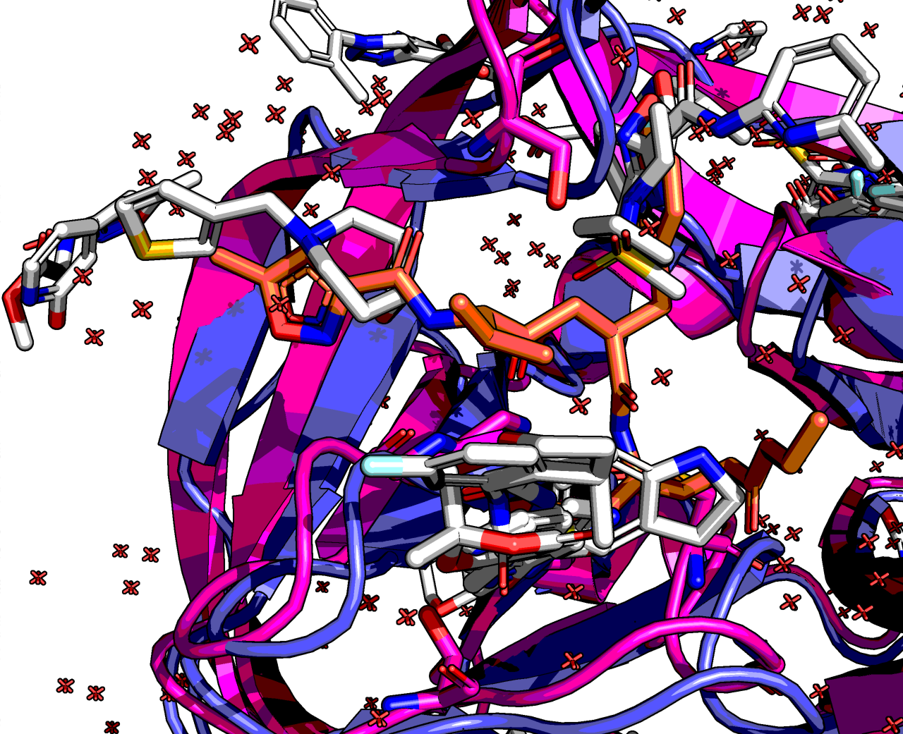
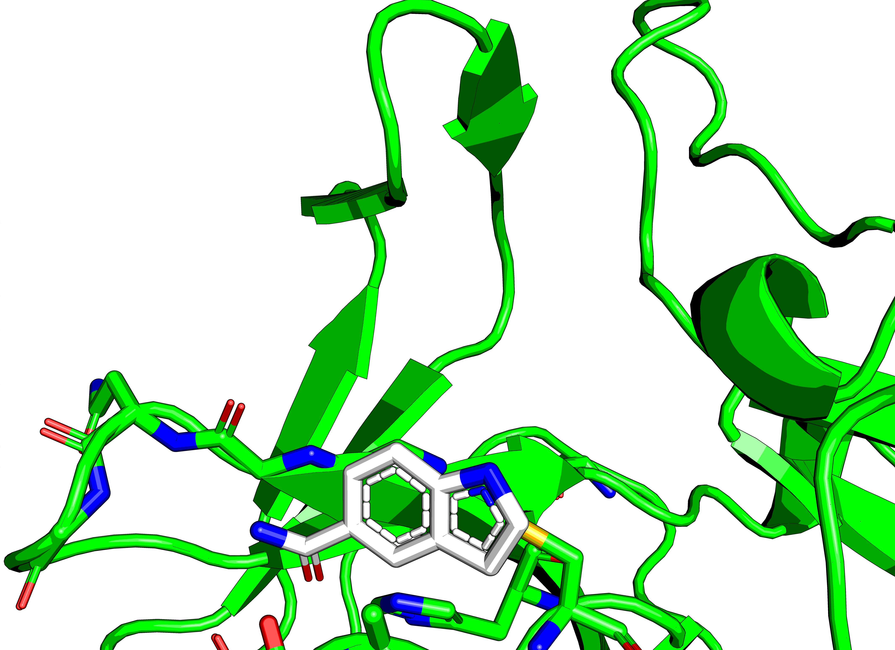
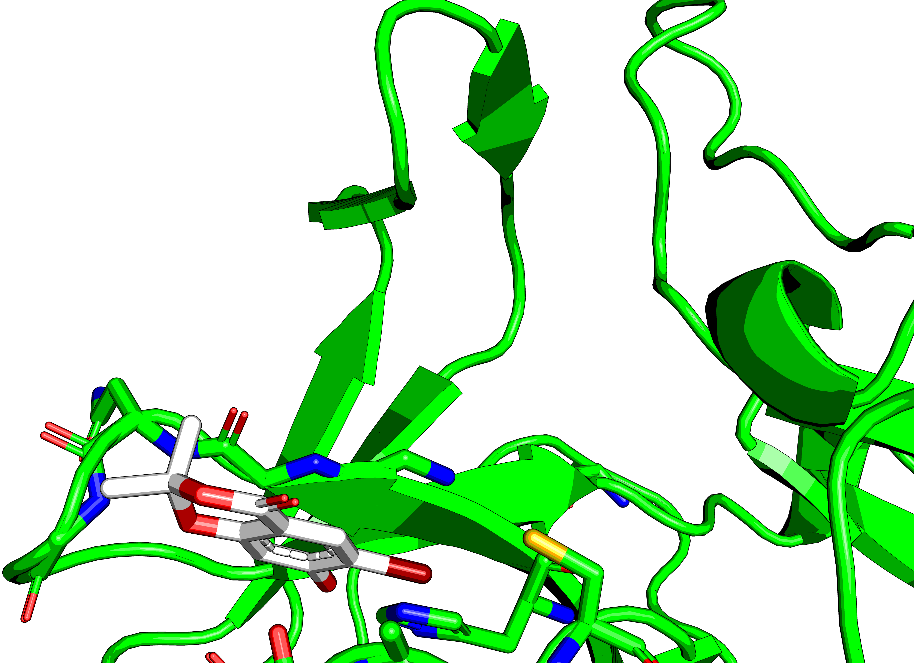
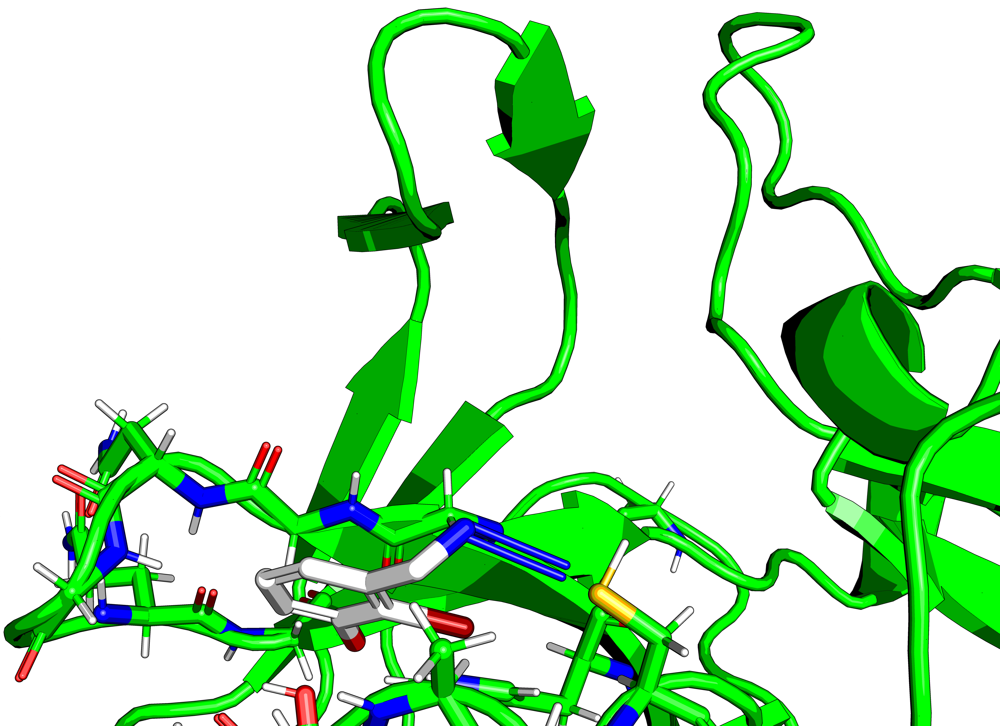

## Observations

A peptidomimetic exists that binds to the active site of the protein similarly to the native substrate.

Some hits bind nearby, but not in the same way.

Of note are x0771:

The aromatic benzene ring is probably forming a &pi;-S bond, but the pyrrolidine is not interacting with the thiol.
It is most likely a waste of space.

and x1604:

This has a bromophenol that interacts with both the catalytic cysteine and the histidine.
The bromide is interacting with the thiol.
This is interesting.

Running ROCS on Enamine BB w/ this scaffold, gives an azide:

Click-chemistry is not doable via the CAR system ATM, but a triazole ring would be very nice there.